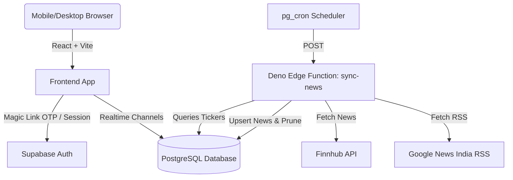

# Antigravity Feed — Portfolio-Centric Market Intelligence App

A premium, modern, portfolio-centric market intelligence web application. The application connects directly to **Supabase** (Auth, Database, Edge Functions) to securely parse portfolio exports, aggregate financial news feeds, and match articles against your stock holdings in real-time.

---

## 🚀 Key Features

* **Instant Broker Integrations:** Import your holdings CSV exported directly from Zerodha (Kite), Upstox, or Groww. The uploader resides in a collapsed bar to maximize screen space.
* **Curated Stock Ribbon:** Dynamically shows all active tickers, rendered with custom gradient badges, search capability, and active state indicators.
* **Aggregated Market Indices:** A horizontally scrollable widget on the **Market** tab tracking Indian indexes (`Nifty 50`, `Sensex`, `Bank Nifty`, `Midcap 100`, `Smallcap 100`) and US indexes (`S&P 500`, `NASDAQ`, `Dow Jones`).
* **Multi-Source News Aggregator Edge Function:**
  * Fetches macro financial highlights from Finnhub.
  * Fetches Indian business highlights from Google News India RSS.
  * Checks active user profile holdings in Postgres, chunks them, and searches Google News RSS for holding-specific news.
* **Personalized Feeds:**
  * **Curated Feed (Home):** Automatically filters news in-memory against your holdings, highlighting matching articles with visual tags and featuring top stories.
  * **General Highlights (Market):** Displays general Indian and global market macro news.
* **Persistent Bookmark System:** Save/bookmark any article from your feed. Bookmarked articles are persisted to your Supabase profile and listed under the **Profile** tab.
* **Mobile Viewport Optimization:** Floating glassmorphic bottom navigation bar with fluid scrolling and custom SVG placeholders styled natively (no Tailwind).

---

## 🛠️ Architecture & Tech Stack



### 1. Database Schema (`PostgreSQL`)

* **`profiles`**: Stores user authentication links, holdings arrays, and bookmarked article IDs.
  * Protected by Row-Level Security (RLS) — users can only read/write their own profile row.
  * Synchronized in real-time with the frontend using PostgreSQL replication (`supabase.channel`).
  * Has a signup trigger `on_auth_user_created` that automatically provisions a profile on new user registration.
* **`news_cache`**: Caches aggregated market and holdings news.
  * Read access is allowed to all authenticated users. Write/delete access is restricted to the database `service_role` (Edge Function).

### 2. Supabase Edge Function (`sync-news`)

Written in TypeScript (Deno runtime), the function runs periodically to pull news from multiple endpoints, parse them, generate unique bigint IDs, map related tickers, upsert articles to PostgreSQL, and prune cached data older than 3 days.

---

## 📂 Project Structure

```
├── frontend/                     # React (Vite) Single Page Application
│   ├── src/
│   │   ├── components/
│   │   │   ├── Auth.jsx          # Supabase Magic Link Auth form
│   │   │   ├── NewsFeed.jsx      # Curated feed & layout renderer
│   │   │   └── PortfolioUpload.js# Collapsible CSV file processor
│   │   ├── App.jsx               # Navigation tabs, profile fetches, realtime
│   │   ├── index.css             # Main styling, glassmorphism tokens
│   │   └── supabaseClient.js     # Supabase SDK initializer
│   └── package.json
└── supabase/                     # Supabase Backend Configuration
    ├── functions/
    │   └── sync-news/            # News aggregator Edge Function (Deno)
    └── migrations/               # SQL Database Schema & Trigger migrations
```

---

## ⚙️ Setup & Installation

### Prerequisites
* [Node.js](https://nodejs.org/) (v18+)
* [Supabase CLI](https://supabase.com/docs/guides/cli)

### 1. Backend Migration
Initialize and link the local project to your remote Supabase instance:

```bash
# Link your Supabase CLI to your remote project ref
npx supabase link --project-ref YOUR_PROJECT_REF

# Push SQL database tables, triggers, and pg_cron settings
npx supabase db push
```

### 2. Deploy Edge Function & Secrets
Set your Finnhub API Key on your Supabase remote secrets and deploy the Deno function:

```bash
# Set Finnhub API token
npx supabase secrets set FINNHUB_API_KEY=your_finnhub_key_here

# Deploy the news synchronization edge function
npx supabase functions deploy sync-news
```

### 3. Frontend Setup
Create an `.env` file inside the `frontend/` directory:

```env
VITE_SUPABASE_URL=https://your-project-ref.supabase.co
VITE_SUPABASE_ANON_KEY=your-anon-key-here
```

Install dependencies and boot up the development server:

```bash
cd frontend
npm install

# Runs the dev server, exposed to your local network for testing on mobile
npm run dev
```

---

## 📱 Testing on Mobile Devices
The dev command has been updated to listen to all network interfaces (`vite --host`). 

When you run `npm run dev`, Vite will print a **Network** address (e.g. `http://192.168.1.15:5173`). Open this URL in your mobile phone browser (while connected to the same Wi-Fi network) to test the native mobile experience!
